# 🖥️ Windows XP — Online Edition

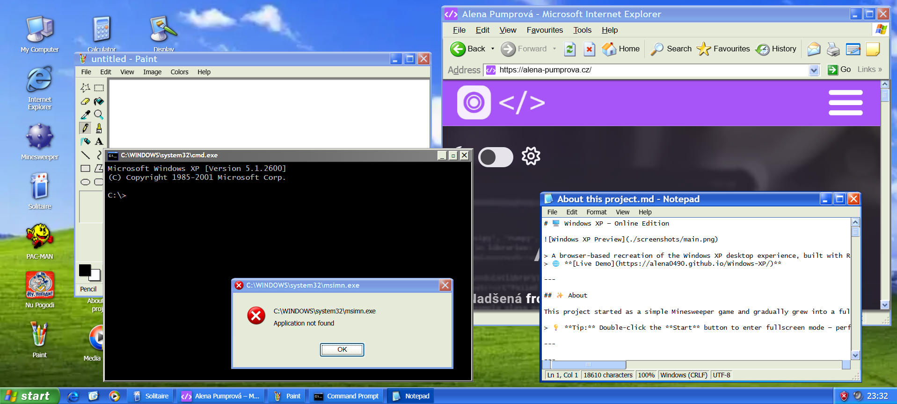

> A browser-based recreation of the Windows XP desktop experience, built with React and TypeScript.  
> 🌐 **[Live Demo](https://alena0490.github.io/Windows-XP/)**

---

## ✨ About

This project started as a simple Minesweeper game and gradually grew into a full Windows XP desktop simulation. It features a working taskbar, Start Menu, draggable windows, XP sound effects, and a collection of functional applications — all styled to match the original Luna theme as closely as possible.

> 💡 **Tip:** Double-click the **Start** button to enter fullscreen mode — perfect for an authentic retro experience without the modern browser bar.

---

## 📑 Table of Contents

### Apps & Games

- [🎮 Minesweeper](#-minesweeper)
- [🎨 Paint](#-paint)
- [🌐 Internet Explorer](#-internet-explorer)
- [📧 Outlook Express](#-outlook-express)
- [🔢 Calculator](#-calculator)
- [💻 Terminal](#-terminal)
- [📝 Notepad](#-notepad)
- [📝 WordPad](#-wordpad)
- [🔤 Character Map](#-character-map)
- [📁 File Manager](#-file-manager) · [🐕 Search Companion (Rover)](#-search-companion-rover)
- [❓ Help and Support Center](#-help-and-support-center)
- [🖼️ Windows Picture and Fax Viewer](#️-windows-picture-and-fax-viewer)
- [🎵 Windows Media Player](#-windows-media-player)
- [🎙️ Sound Recorder](#️-sound-recorder)
- [🎨 Plus! Skins](#-plus-skins)
- [🃏 Solitaire](#-solitaire)
- [⌨️ On-Screen Keyboard](#️-on-screen-keyboard)
- [🖥️ Windows Plus!](#️-windows-plus)

### Appearance

- [🎨 Display Properties](#-display-properties)
- [🖼️ Color Themes](#️-color-themes)
- [🖼️ Windows Plus! Themes](#️-windows-plus-themes)

### System

- [🪟 Desktop & Shell](#-desktop--shell)

### Project

- [🌐 Browser Support](#-browser-support)
- [🛠️ Tech Stack](#️-tech-stack)
- [🔊 Assets & Credits](#-assets--credits)
- [📄 License](#-license)
- [🚧 Coming Soon](#-coming-soon)

---

## 🎮 Minesweeper


The app that started it all. A fully functional Minesweeper with three difficulty levels and a custom board option.

- **Beginner** (9×9, 10 mines) · **Intermediate** (16×16, 40 mines) · **Expert** (16×30, 99 mines)
- Custom board size (height 9–24, width 9–30, mines 10+)
- Safe first click — mines are never placed on the first clicked cell or its neighbours
- Flood fill reveal for empty cells
- Flag 🚩 and question mark ❓ markers (toggleable)
- Digital mine counter and timer (capped at 999)
- Best times saved to `localStorage` per difficulty
- Sound effects for clicks, win and loss
- Animated face button (😊 / 😲 / 😎 / 💀)
- Death cell highlighted in red

---

## 🎨 Paint


A feature-rich recreation of MS Paint with a full toolbox, colour palette and menu system.

### Tools

- ✏️ Pencil · 🖌️ Brush (round, square, diagonal ×3 sizes) · 💨 Airbrush (3 sizes)
- 🪣 Fill bucket · 💧 Eyedropper · 🔤 Text (with Font toolbar — family, size, bold, italic, underline, vertical)
- ⬜ Rectangle · 🔲 Rounded Rectangle · ⭕ Ellipse · 🔷 Polygon · 〰️ Curve · ➖ Line
- ⬛ Eraser (4 sizes) · 🔍 Zoom (1×/2×/6×/8×) · ✋ Move (pan)
- Rectangular and free-form selection — drag, copy, cut, delete, Ctrl+A

### Canvas

- Default size 700×400 px, resizable via Attributes dialog
- Undo / Redo history · Invert Colours · Flip / Rotate · Stretch / Skew
- Grid overlay (Ctrl+G) · Thumbnail preview (live, 150×100 px)
- Save As `.png` · Open image file · View Bitmap (fullscreen)
- Middle-mouse pan · Pinch-to-zoom on touch (0.25×–4×)
- Custom cursors per tool

**Colour palette** — 40 classic XP colours, foreground/background swap

---

## 🌐 Internet Explorer

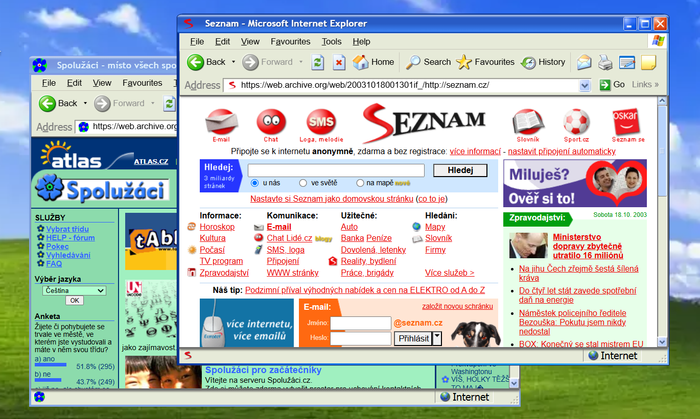

A working browser window powered by `<iframe>`, styled as Internet Explorer 6.

- Full menu bar (File, Edit, View, Favourites, Tools, Help) with mnemonics and nested submenus
- Standard toolbar (Back, Forward, Refresh, Stop, Home, Search, Favourites, History, Print…)
- Address bar with favicon, live page title in the title bar
- Navigation history (back / forward)
- Status bar and toggleable toolbars
- Blocked domains list (social media, modern news sites, adult content, AI tools…)
- Custom error page when a blocked or unavailable site is requested
- **Multiple windows** — open several IE windows simultaneously, each with its own navigation history, page title and favicon
- Each open window appears as a separate taskbar button showing the current page title and favicon
- **File > New Window** — opens a new IE window loaded with the current page
- **View Source** — opens the current page's HTML source in Notepad

### 🕰️ Favourites — Retro Websites

All bookmarks point to period-accurate archived versions of real websites, sourced from the [Wayback Machine](https://web.archive.org) (primarily 2001–2005).

| Folder | Highlights |
| --- | --- |
| 🔍 Search & Mail | Google, Seznam.cz, Seznam E-mail, ICQ, xChat, Centrum.cz |
| 👥 Social | Lidé.cz, Spolužáci, Libimseti.cz, LinkedIn, Zpovědnice |
| 🎮 Games | Superhry.cz, Českéhry.cz, Happy Tree Friends, Miniclip |
| 🎬 Entertainment | Alena Pumprová, Nova.cz, Kinobox.cz, Lamer.cz, iDnes.cz, Očko TV |
| 💻 Tech | Microsoft.com , Mobilmania.cz, MSN |

---

## 📧 Outlook Express

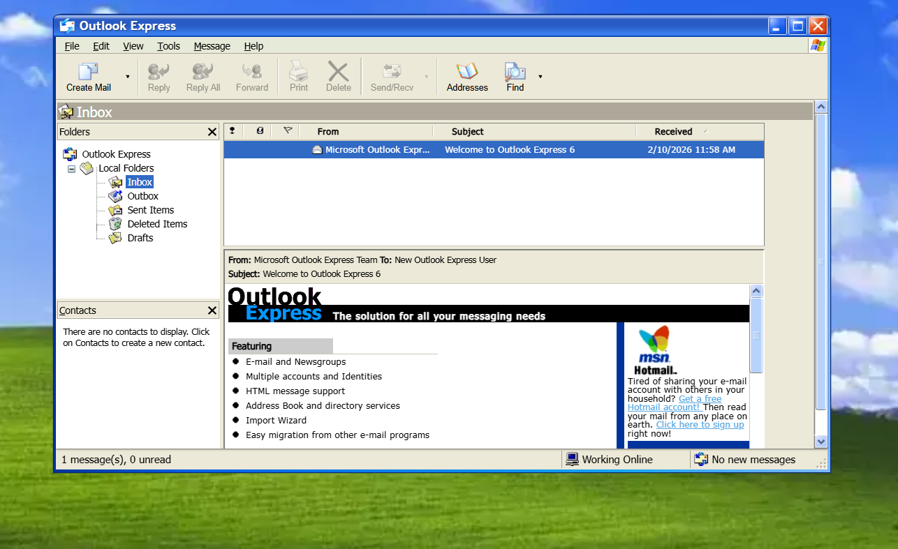

A recreation of Outlook Express 6, with local folders, a working message list, and a fully functional compose window that sends real email via EmailJS.

### Folders & Messages

- **Local Folders** — Inbox, Outbox, Sent Items, Deleted Items, Drafts, navigable via a classic Windows tree view with dotted guide lines
- Local Folders overview page — table listing each folder with unread/total message counts
- Message list adapts per folder — shows *From* for Inbox/Deleted, *To* for Sent/Drafts/Outbox, with a Flag column on Inbox and Deleted Items
- Read/unread envelope icons, unread counts shown in the folder tree and window title
- Read state persisted across sessions via `localStorage`
- Preview pane — click a message to read it, with links opening in Internet Explorer
- **"Go directly to my Inbox" on startup** — optional, persisted setting

### Toolbar & Menus

- Full menu bar (File, Edit, View, Tools, Message, Help) with mnemonics and nested submenus
- Context-aware toolbar — Reply, Reply All, Forward, Print and Delete only appear once a folder is open
- **Create Mail** split button with a Stationery dropdown (six designs + Blank), Select Stationery dialog and Send Web Page dialog
- **Window Layout** dialog — toggle the Contacts and Folder List panes on or off
- Identities dropdown (Switch/Add/Manage Identities) and Find bar, styled after the original
- **Tip of the Day** panel with animated Previous/Next transitions

### Compose Window (New Message)

- Draggable, minimisable, maximisable/fullscreen compose window, independent of the main Outlook Express window
- **Sends real email** via EmailJS
- Apply Stationery — six period-styled backgrounds and banners (Leaves, Citrus Punch, Sunflower, Maize, Clear Day, Nature) or Blank
- Bcc field toggle, Insert Signature, Set Priority (High/Normal/Low)
- Formatting toolbar (font, size, bold/italic/underline, alignment, lists) styled as disabled — visual only, matching the read-only recipient fields
- Full New Message menu bar (File, Edit, View, Insert, Format, Tools, Message, Help)

---

## 🔢 Calculator


A two-mode calculator with keyboard support.

### Standard mode

- Basic arithmetic · Memory (MC / MR / MS / M+) · `sqrt`, `%`, `1/x`
- Digit grouping (cs-CZ locale)

### Scientific mode

- Trigonometry: `sin`, `cos`, `tan` with **Inv** (arcus) and **Hyp** modifiers
- Angle modes: Degrees · Radians · Grads
- `log`, `ln`, `x²`, `x³`, `xʸ`, `n!`, `π`, `1/x`, `Int`, `F-E`, `Exp`, `dms`
- Bitwise: `And`, `Or`, `Xor`, `Not`, `Lsh`, `Mod`
- Number bases: **Hex** · **Dec** · **Oct** · **Bin** — unavailable digits disabled automatically

---

## 💻 Terminal


A Command Prompt window with an authentic XP look and a set of working commands.

- Font: Lucida Console · Width: 80ch · 25 visible lines
- `color XY` supports 16 colours (e.g. `color 0A` = black background, green text)
- `systeminfo` reveals developer info 🙂

```C:\>help

Available commands:
  help       - Show this help
  cls        - Clear screen
  dir        - List installed apps with file sizes
  echo       - Print text
  ver        - Show Windows version
  date       - Show current date
  time       - Show current time
  systeminfo - Show system & developer info
  color XY   - Change background and text colour (16 colours)
  exit       - Close the window
```

---

## 📝 Notepad

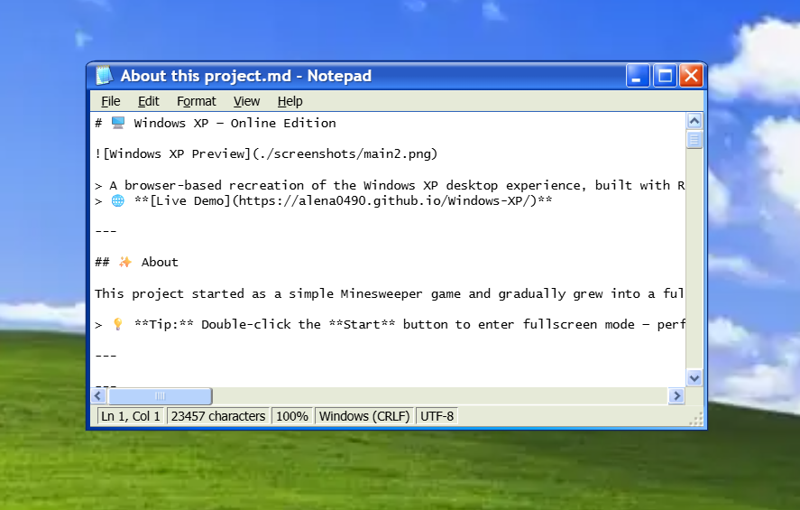

A lightweight text editor with more features than you might expect.

- Open and save `.txt` files
- Undo / Redo (custom history stack)
- **Find** — with Match Case, Wrap Around and Up/Down direction
- **Replace** and **Replace All**
- Word Wrap toggle
- Insert Date/Time
- Status bar: line, column, character count, encoding (UTF-8), line endings (CRLF)
- Classic Windows XP encoding bug — typing "Bush hid the facts" or "what are you doing" and saving will garble the text on reopen

---

## 📝 WordPad

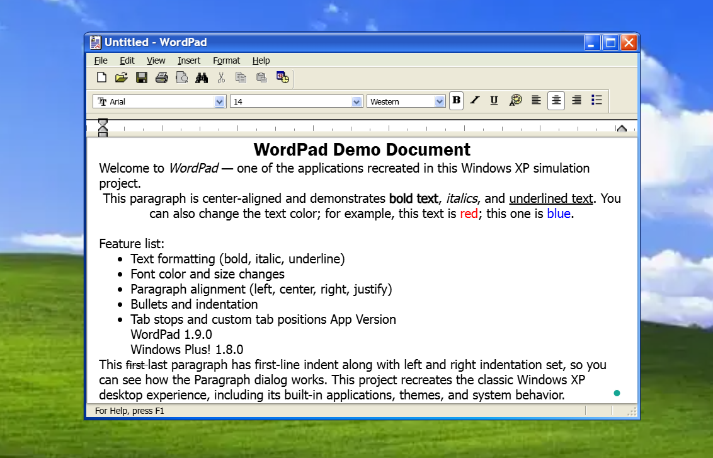

A recreation of WordPad with rich text formatting, built on a `contentEditable` document view.

### Formatting

- Formatting toolbar — font family and size picker (with TrueType/OpenType/bitmap type icons), font colour, bold, italic, underline
- Paragraph alignment — left, center, right · bullet list toggle
- **Font dialog** with live sample preview, strikeout and underline options, and colour picker
- **Paragraph dialog** — left/right indentation and first-line indentation, paragraph alignment
- **Tabs dialog** — set, clear and clear all custom tab stop positions, shown live as markers on the ruler
- Pressing Tab jumps the cursor to the nearest custom tab stop, or a default 0.5" grid if none are set

### Layout

- Draggable ruler for adjusting left/right margins, with tab stop markers
- Toggleable Toolbar, Format Bar, Ruler and Status Bar (View menu)

### Editing

- Undo / Redo (custom history stack, debounced snapshots)
- **Find** and **Replace** (shared logic with Notepad), with alert when the searched word isn't found
- Insert Date/Time
- **Insert Object** dialog — including embedding a Paintbrush picture created and sent from Paint
- Select All, Cut, Copy, Clear, each with the matching keyboard shortcut
- Open / Save / Save As, unsaved-changes confirmation dialog, recent documents list

### Integration

- Right-click context menu
- Works with the On-Screen Keyboard — types directly into the document
- Full menu bar with mnemonics (File, Edit, View, Insert, Format, Help)

---

## 🔤 Character Map

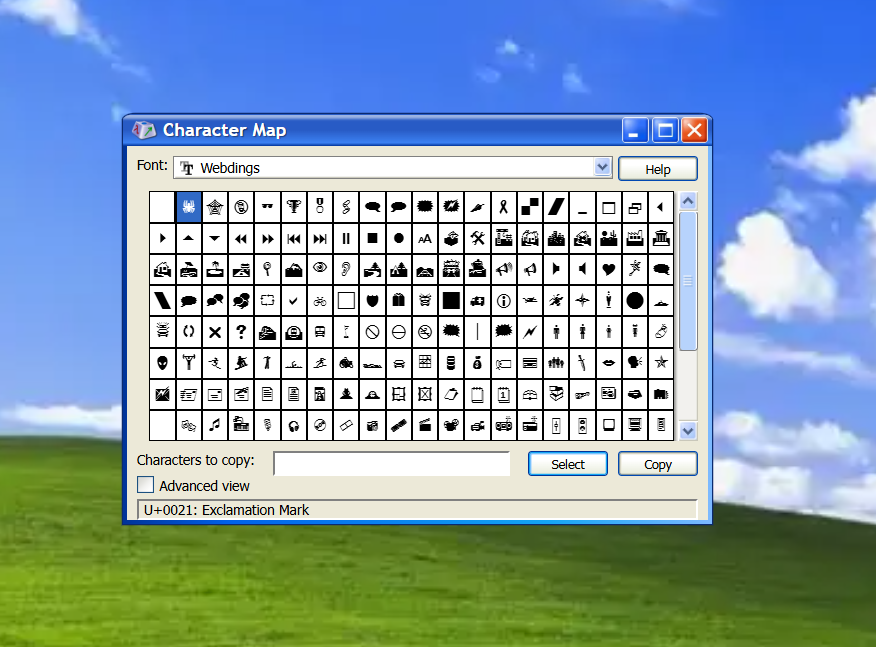

A recreation of the Windows XP Character Map utility for browsing and copying special characters from any installed font.

- Font picker with TrueType/OpenType/bitmap type icons, matching the style used in WordPad's font picker
- Character grid reads each font's actual glyph table (via `opentype.js`), so symbol and script fonts (Wingdings, Latha, Mangal…) show their real characters instead of the basic Latin set
- Click a character to select it, double-click (or use **Select**) to add it to the copy field
- **Copy** button copies the assembled string to the clipboard
- Status bar shows the Unicode code point and character name of the current selection
- Windows-1252 mapping for the `0x80–0x9F` range, so typographic characters (€, en/em dash, curly quotes…) display correctly instead of control-code placeholders
- Hover tooltip shows a magnified preview of the character along with its Unicode code point and name

---

## 📁 File Manager


A recreation of Windows Explorer with full folder navigation and multiple view modes.

### Features

- **5 view modes** — Thumbnails, Tiles, Icons, List, Details
- Full folder tree navigation with Back / Forward / Up buttons and keyboard shortcuts (Backspace, Alt+←, Alt+→)
- Breadcrumb address bar with clickable path segments
- Sort by Name, Size, Type or Date Modified
- **Picture Viewer** — inline image viewer with filmstrip, Prev/Next navigation (keyboard arrows supported) and rotation
- **Sidebar** — context-aware Tasks, Other Places and Details panels, collapsible groups
- **History** sidebar and Tip of the Day panel
- Thumbnail previews for image files, photo folder preview (2×2 grid)
- Status bar with object count and current path
- Open `.txt` files directly in Notepad
- Original Windows XP sample pictures and wallpapers

## 🐕 Search Companion (Rover)

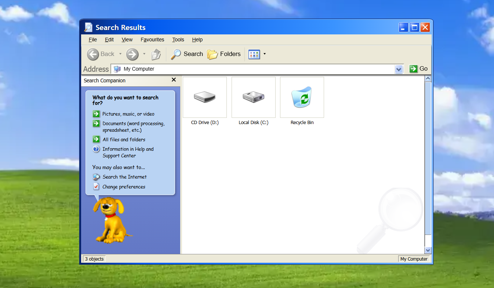

The File Manager features a fully animated Rover — the original Windows XP Search Companion dog — powered by PNG frame sequences and a sprite sheet extracted from the original `rover.acs` Microsoft Agent file.

- **PNG animations** — `come`, `exit`, `ashamed`, `lick`, `reading`, `sleep`, `tired`, `haf`, `attention`, `speak` and 10 idle variants
- **Sprite sheet animations** — `searching`, `pleased`, `congratulate`, `show`, `hide`, `thinking`, `shopping`, `sports`, `travel`, `money`, `writing` and more, extracted directly from `rover.acs`
- **State machine** — `show` on open → idle cycling → `searching` during search → `pleased`/`characterSucceeds` on success → `ashamed` on failure → `tired` → `sleep` after inactivity
- **Sound effects** — sniffing, whining, tapping, snoring, barking and more from the original `.wav` resources
- **You rang?** — click Rover to open the interaction panel; "Do a trick" plays a random idle or trick animation

- Also available directly in Internet Explorer via the Search toolbar button or View > Explorer Bar > Search

---

## ❓ Help and Support Center

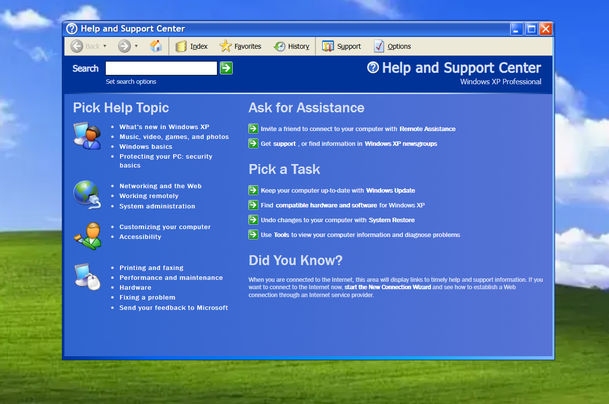

A recreation of the Windows XP Help and Support Center, with full topic navigation, search, and history tracking.

### Navigation

- Two-panel layout — left tree navigation, right article content, per topic category
- Back / Forward / Home toolbar with history-aware navigation stack
- **Index** — searchable keyword index across all help topics, live filtering as you type
- **Favorites** — add/rename/remove articles, persisted via `localStorage`
- **History** — list of previously viewed pages in the session, double-click to reopen
- **Options** and **Support** pages

### Topic categories

- What's new in Windows XP · Music, video, games, and photos · Networking and the Web
- Working remotely · Customizing your computer · Printing and faxing
- Performance and maintenance · Windows basics · Protecting your PC: security basics
- System administration · Accessibility · Hardware · Fixing a problem

### Articles

- Expandable/collapsible tree items (Plus/Minus icons) for nested subtopics
- Add to Favorites with duplicate-detection dialog
- Print / Locate in Contents — trigger period-accurate XP error dialogs
- Change View toggle (fullscreen / windowed)
- Article content includes task lists, overviews, and glossary-linked terms

---

## 🖼️ Windows Picture and Fax Viewer

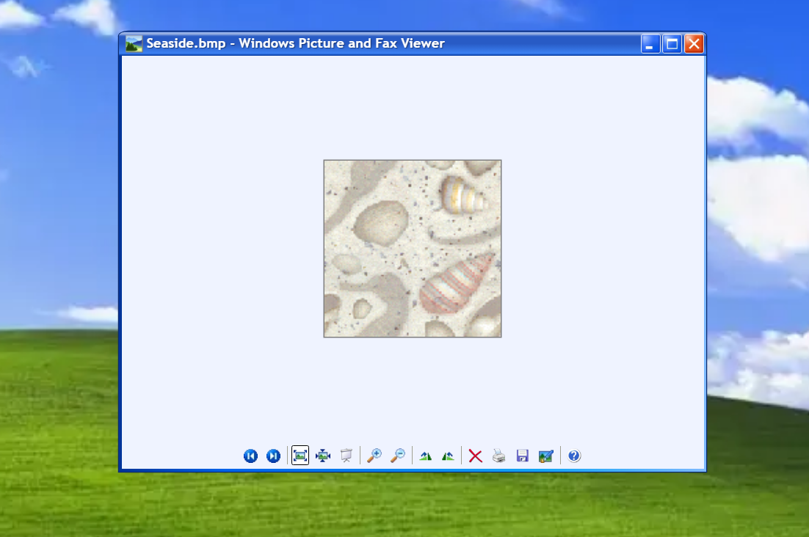

A recreation of the Windows XP Picture and Fax Viewer, opened directly from File Manager's image thumbnails.

- Fit / Actual Size toggle · Zoom in/out (0.25×–3×) · Rotate left/right
- Previous / Next navigation through the current folder's images, keyboard arrows supported
- **Slideshow mode** — fullscreen, auto-advances every 3s, Play/Pause, Prev/Next and Stop controls that auto-hide after 3s of inactivity, dismissible with `Esc` or `F11`
- Launched from File Manager's Picture Tasks sidebar ("View as a slide show") or by opening an image directly
- Keyboard shortcuts — `←/→` navigate · `F11` toggle slideshow · `Esc` exit slideshow · `+/-` zoom · `Ctrl+A` actual size · `Ctrl+B` best fit · `Ctrl+K/L` rotate · `Ctrl+E` edit in Paint
- Error dialogs for Print / Save / Delete / Help (`printerConnect`, `accessDenied`) matching original XP behaviour

---

## 🎵 Windows Media Player


A recreation of Windows Media Player 8, with full playlist support, visualizations, album art and skinnable Plus! themes.

### Playback

- Play, Pause, Stop, Previous, Next
- Shuffle and Repeat modes
- Play Speed — Slow (0.5×), Normal (1×), Fast (2×)
- Volume control with XP-style slider and Mute toggle
- Progress bar with seek support
- Auto-advance to next track when a song ends
- Keyboard shortcuts — `Ctrl+P` Play/Pause · `Ctrl+S` Stop · `Ctrl+B` Previous · `Ctrl+F` Next · `Ctrl+H` Shuffle · `Ctrl+T` Repeat · `F8` Mute · `F9` Volume Down · `F10` Volume Up

### Playlist & Library

- Opens songs directly from File Manager (double-click `.mp3`)
- Entire folder loaded as playlist automatically
- Playlist shows track names and durations
- Total playlist time displayed
- Click any track in the playlist to jump to it
- Open button launches File Manager to browse music

### Visualizations

- **Album Art** — displays cover image when available
- **Ambience** — Water · Falloff · Swirl · Random
- **Bars and Waves** — Bars · Ocean Mist · Fire Storm · Scope
- **Battery** — Randomization · Lotus · Event Horizon · Smoke or Water?
- **Particle** — Particle · Rotating Particle
- **Plenoptics** — Random · Smokey Circles · Smokey Lines · Vox
- **Spikes** — Spike
- **Musical Colors** — Colors in Motion
- Switch visualizations via menu or ✱ dropdown · cycle presets with ◀ ▶ buttons

### UI

- Full menu bar — File, View, Play, Tools, Help
- Full Mode / Skin Mode toggle (`Ctrl+1` / `Ctrl+2`)
- **Skin Mode** — four selectable Windows Media skins (Nature, Space, Da Vinci, Aquarium), switchable via an in-app Skin Chooser
- Aquarium skin includes a working-style equalizer drawer (bass / treble / balance) and volume drawer with a matching drawer-open/close animation
- Video viewer overlay for playing video files directly within the skinned player
- Fullscreen mode
- Left sidebar with navigation categories
- Taskbar integration — minimize and restore

### 🎨 Plus! Skins

Four Windows Media Player skins from Windows Plus!, switchable via the in-app Skin Chooser.

| Plus! Aquarium | Plus! Da Vinci |
| --- | --- |
| 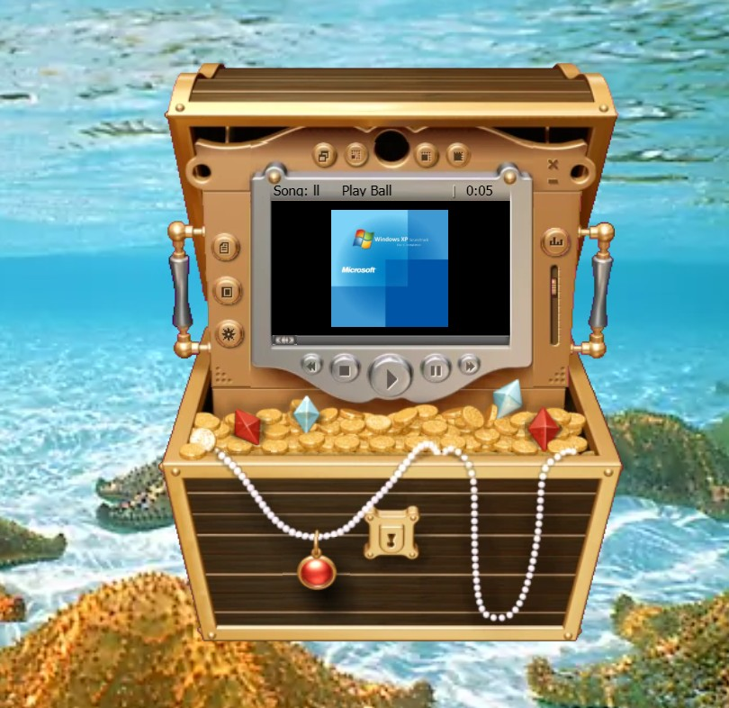 | 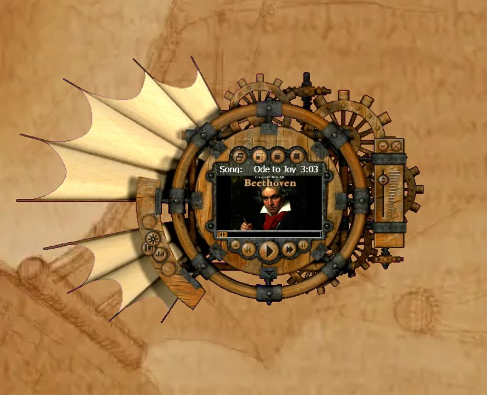 |

| Plus! Nature | Plus! Space |
| --- | --- |
| 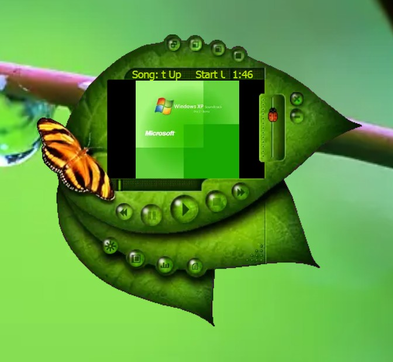 | 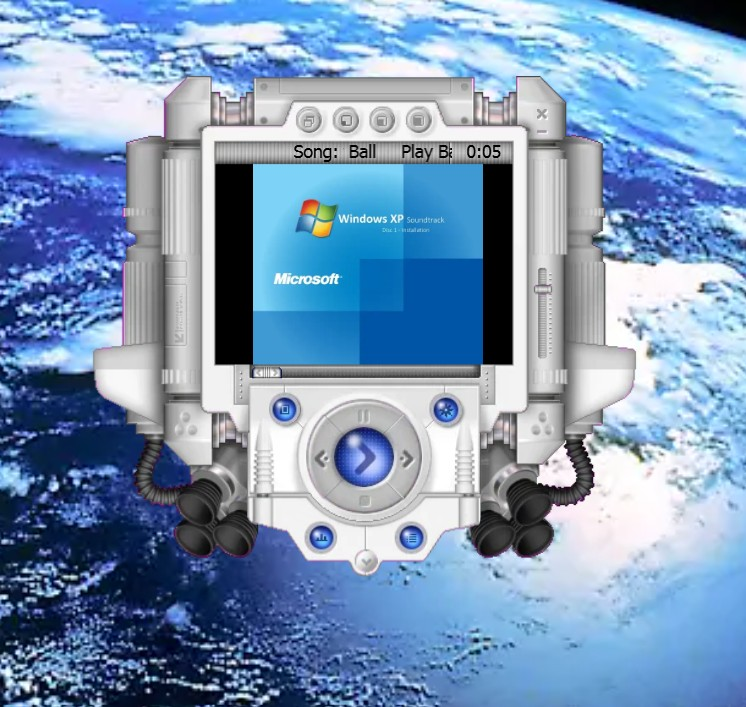 |

---

## 🎙️ Sound Recorder

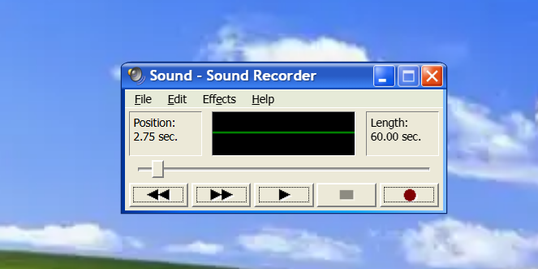

A recreation of the Windows XP Sound Recorder, with real microphone recording, waveform display and audio effects powered by the Web Audio API.

### Recording & Playback

- Record from the microphone, Stop pauses and Record resumes into the same take (no loss on pause/resume)
- Play, Stop, Prev/Next (0.5s skip)
- Live waveform display during recording and playback
- Draggable Position slider with seek support
- New / Open (via File Manager) / Save / Save As, with unsaved-changes confirmation dialog

### Effects

- Increase / Decrease Volume (by 25%)
- Increase / Decrease Speed (by 100%) — true resampling, changes both pitch and duration
- Add Echo
- Reverse

### Window

- Draggable, minimisable XP window with system menu
- About and Properties dialogs

---

## 🃏 Solitaire

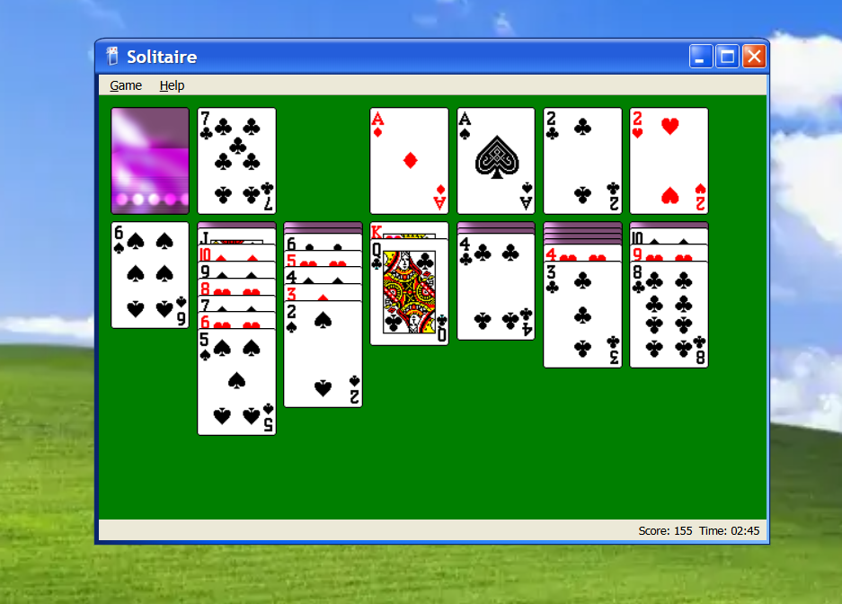

A recreation of Windows XP Solitaire with full game logic and scoring.

- Draw One / Draw Three modes
- Standard, Vegas and None scoring
- Vegas Cumulative Score across games
- Timed game with time bonus on win
- Undo support
- Outline dragging
- 12 card back designs
- Drag & drop and click-to-move
- Double-click to auto-move card to foundation
- Keyboard shortcuts — `F2` Deal · `Ctrl+Z` Undo

---

## ⌨️ On-Screen Keyboard

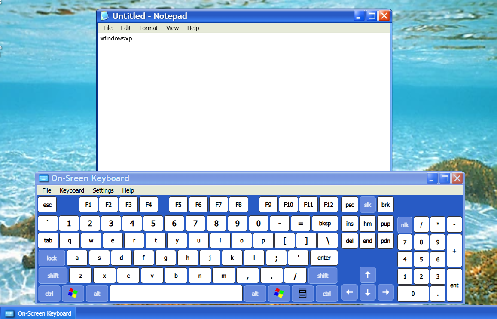

A recreation of the Windows XP On-Screen Keyboard accessibility tool, with a full menu system, multiple layouts and live typing into any focused field.

### Typing

- Types directly into the last focused `input` or `textarea` anywhere on the desktop
- **Sticky Shift** — click left or right Shift to capitalise the next character (toggle on/off)
- **Caps Lock** with active-state indicator
- Editing keys — Backspace, Delete, Enter, Home, End and arrow keys with full cursor/selection logic (multi-line aware in textareas)
- `Windows` key opens the Start Menu · `Calculator` key launches the Calculator
- Optional **click sound** on key press (toggleable)

### Views & Layouts

- **Enhanced** / **Standard** keyboard views
- **Regular** / **Block** layout
- **101** / **102** key modes (106-key mode reserved)
- Function row (F1–F12), navigation cluster (Ins, Home, PgUp, Del, End, PgDn), numeric keypad and arrow keys

### Menu & Settings

- Full menu bar — File, Keyboard, Settings, Help — with mnemonics
- **Always on Top** toggle
- **Font** dialog — pick family, style and size from the installed Windows Fonts, with live sample preview
- Welcome dialog on first launch, with a *"Do not show this message again"* option (remembered via `localStorage`)
- About dialog

<!-- markdownlint-disable MD024 -->
### Window

- Draggable, minimisable and fullscreen-capable XP window
- Taskbar integration

---

## 🖥️ Windows Plus!

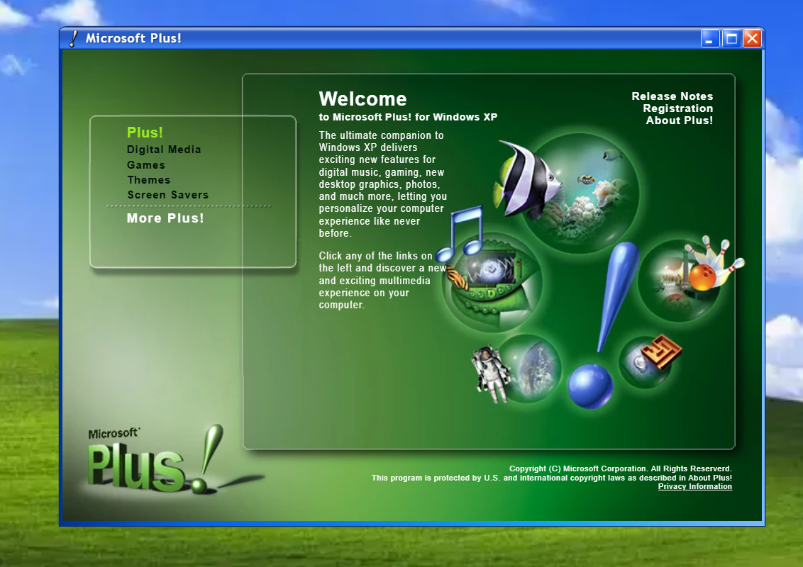

A recreation of the Microsoft Plus! for Windows XP control panel — a draggable, minimisable, fullscreen-capable window built with the original Plus! background artwork and CSS colours sourced from period-accurate references, complete with theme-specific menu sounds and a Start-Menu-style left navigation.

### Navigation

- Left sidebar menu — Digital Media, Games, Themes, Screen Savers, More Plus!, plus a Home hotspot that returns to the Welcome page
- Welcome page with links to Release Notes (opens the GitHub release in Internet Explorer), Registration and About Plus!

### Digital Media

- Seven showcased products — Plus! Voice Command for Windows Media Player, Plus! MP3 Audio Converter, Plus! CD Label Maker, Plus! Speaker Enhancement, Plus! Personal DJ, Windows Media Player Skins, Plus! 3-D Visualizations
- Click any product title to expand its description

### Games

- Three showcased games — Russian Square Plus! Edition, The Labyrinth Plus! Edition, HyperBowl Plus! Edition — each with artwork and description

### Themes

- Choose between the four Plus! themes (Aquarium, Space, Nature, Da Vinci) with a live background preview that updates instantly as you pick one
- "Select the theme" jumps straight into Display Properties → Themes with the chosen theme preselected
- See [Windows Plus! Themes](#️-windows-plus-themes) below for screenshots of all four themes applied to the desktop

### Screen Savers

- Eight screensavers — Aquarium, My Pictures, Space, Nature, Da Vinci, Robot Circus, Sand Pendulum, Mercury Pool — each with a live preview image
- **Preview** runs the actual screensaver · **Select this screen saver** jumps into Display Properties → Screen Saver with the chosen screensaver preselected

### More Plus

- Thank-you page with links out to the real project website and GitHub repository
- "Tell me when new versions are available" opt-in checkbox

### About & Registration

- Dedicated **About Plus!** dialog — period-accurate Windows Plus! about box with product info, version, product ID and image credits
- **Registration** opens a dedicated Plus! error dialog

---

## 🎨 Display Properties

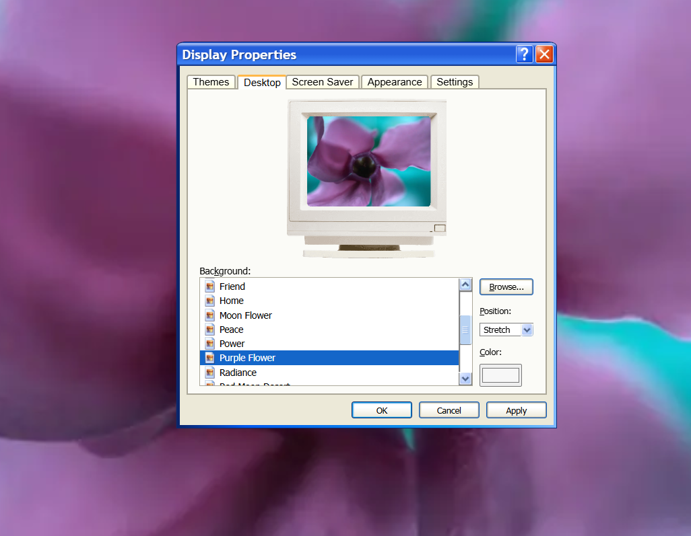

A faithful recreation of the Windows XP Display Properties dialog, accessible from the desktop icon or Start Menu.

- **Themes** — switch between Windows XP and four Windows Plus! theme packs (Aquarium, Da Vinci, Nature, Space), each automatically applying matching wallpaper and screensaver
- **Desktop** — 27 original XP wallpapers + 7 Plus! wallpapers, live CRT monitor preview, position (Stretch / Center / Tile), background color picker, Browse via File Manager
- **Screen Saver** — 13 screensavers with live preview in CRT monitor, configurable wait time
- **Appearance** — switch between three color schemes, live preview updates instantly without page reload
- **Settings** — screen resolution slider (640×480 to 1600×1200) and color quality selector, CRT preview updates with blur and saturation effects based on selected resolution

## 🖼️ Color Themes

Three built-in Windows XP color schemes, switchable live from Display Properties → Appearance.

| Default (blue) | Olive Green | Silver |
| --- | --- | --- |
| 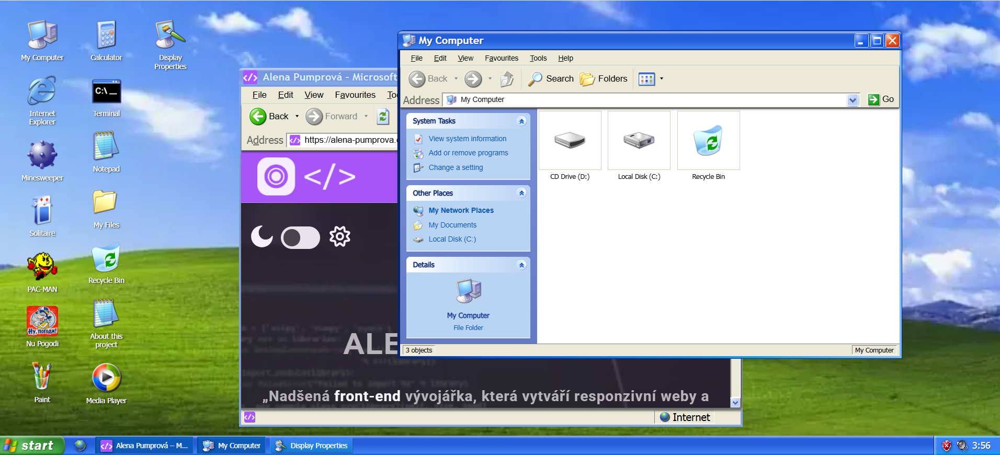 | 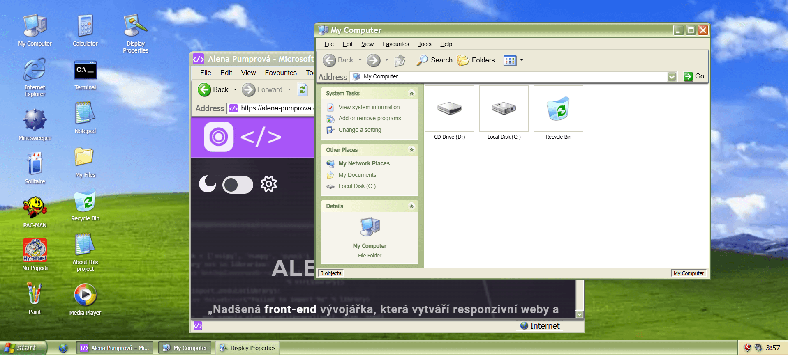 | 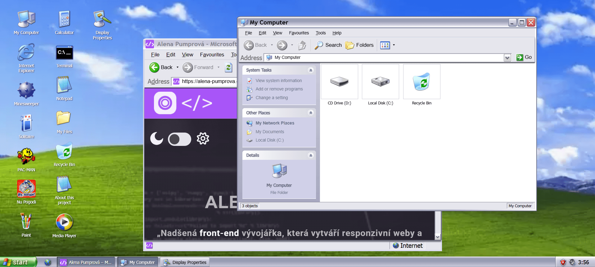 |

## 🖼️ Windows Plus! Themes

Four theme packs from Windows Plus!, switchable from Display Properties → Themes, or from the dedicated [Windows Plus!](#️-windows-plus) control panel window — custom cursor sets, wallpapers, theme-specific system sounds and a matching Recycle Bin icon for each theme.

| Plus! Aquarium | Plus! Da Vinci |
| --- | --- |
| 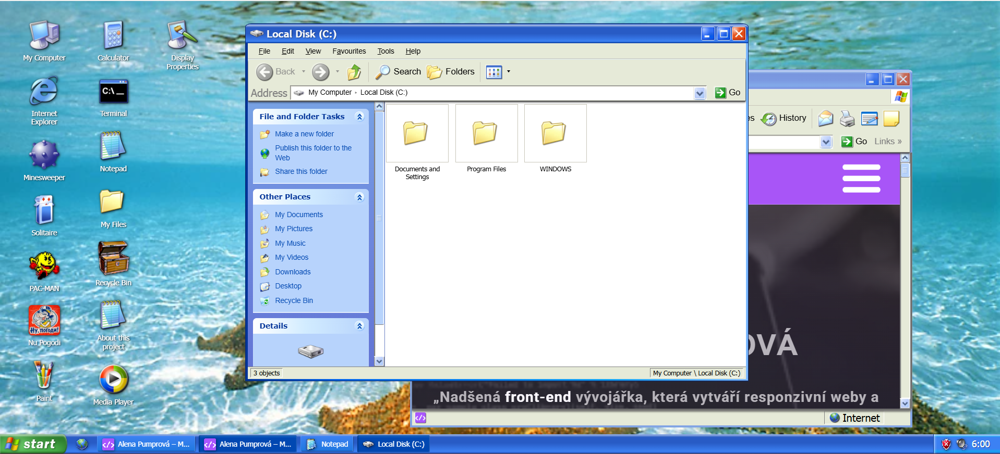 | 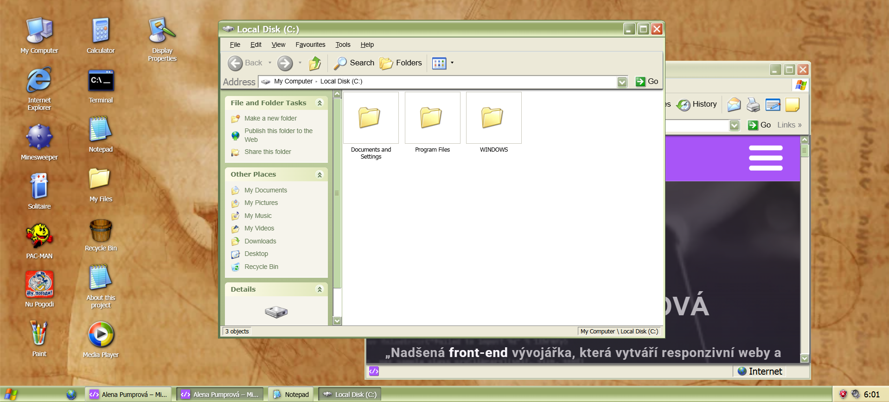 |

| Plus! Nature | Plus! Space |
| --- | --- |
| 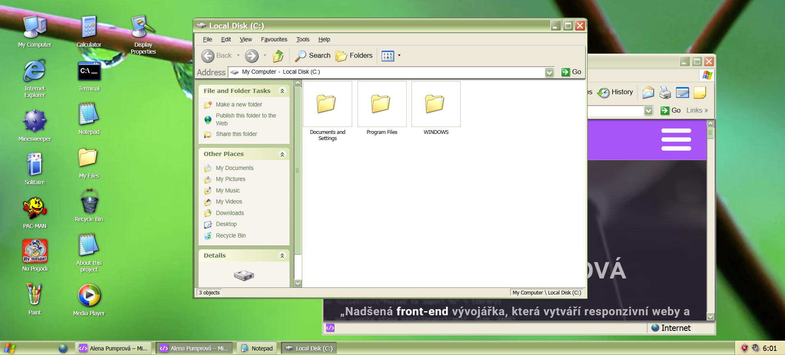 | 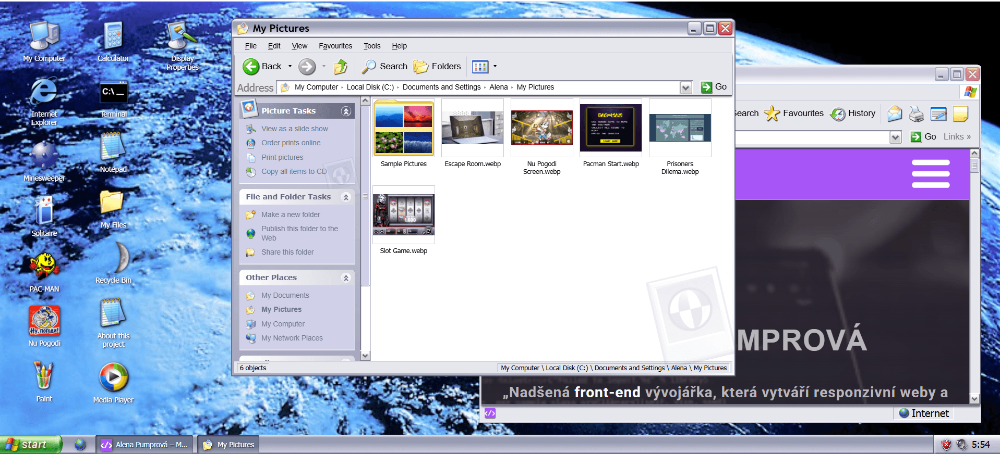 |

---

## 🪟 Desktop & Shell

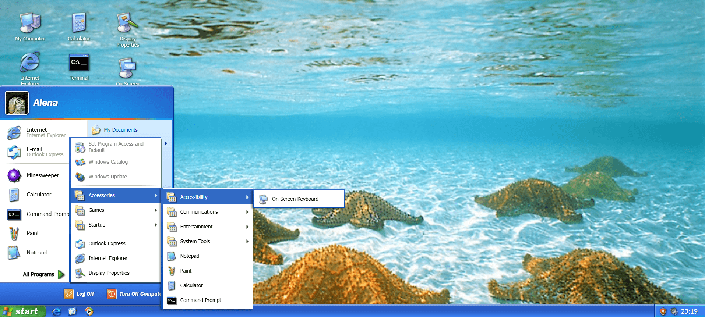

- **Taskbar** — shows open applications, active/minimised state, live clock, volume icon and a security notification balloon (appears after 5 seconds)
- **Volume Control** — full sndvol32-style mixer opened from the taskbar volume icon: master "Volume Control" plus Wave, SW Synth, Line In and CD Audio channels, each with its own volume slider, balance and Mute. Wave drives all system sounds and CD Audio drives Windows Media Player playback. Includes Options/Help menu with mnemonics and an About dialog. A simple volume popup is also available directly from the taskbar.
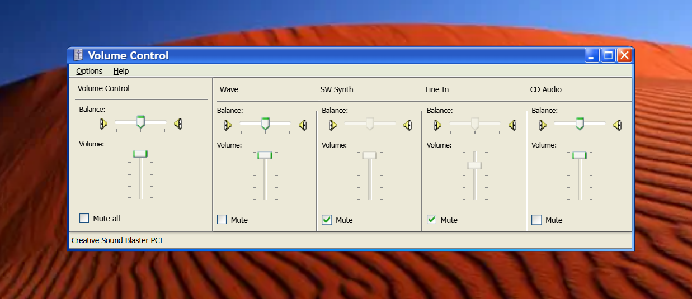
- **Start Menu** — full two-panel layout with user avatar (Alena 🐱), pinned apps, All Programs submenu (Accessories, Games), right panel with system shortcuts, Log Off and Turn Off Computer buttons
- **Run dialog** — launch apps by command (`notepad`, `calc`, `mspaint`, `iexplore`, `cmd`, `explorer`, `wmplayer`, `desk.cpl`, `osk`…), with command history dropdown and Browse button
- **Desktop icons** — My Computer, Internet Explorer, Minesweeper, Solitaire, Paint, Calculator, Terminal, Notepad, Wordpad, Recycle Bin, Windows Media Player...qq
- Desktop icon layout automatically recomputes on window resize and fullscreen toggle, while preserving any icons the user has manually repositioned
- **Error dialogs** — `appNotFound`, `accessDenied`, `hardDriveFailure`, `renameExtension` — each with the correct icon and button set
- **Login Screen** — Windows XP-style login displayed on startup, pre-filled credentials, also gates browser autoplay restrictions
- **XP Loading Screen** — animated progress bar, Windows XP logo, startup sound, shown on startup and after Restart


- **Shutdown Screen** — Turn Off Computer and Log Off dialogs opened from the Start Menu, with Stand By / Restart / Switch User options and animated grayscale overlay


---

## 🌐 Browser Support

Best experienced in **Chrome** and **Edge**. Some features may not work correctly in **Firefox**.

On screens narrower than 900px, the desktop is replaced with a *"This application is designed for desktop use only"* notice — recreating Windows XP, with its fixed-size windows and pixel-perfect Luna styling, simply doesn't belong on mobile.

---

## 🛠️ Tech Stack

- **React 18** + **TypeScript**
- **Vite** (with manual chunk splitting per app)
- **EmailJS** (`@emailjs/browser`) — sends real email from the Outlook Express compose window
- Custom hooks — `useDraggable`, `useDraggableDialog`, `useWindowState`, `useSound`, `usePaintHistory`, `usePaintSelection`, `usePaintShapeDrawing`, `usePaintPanning`, `usePaintFileActions`, `useCalculatorLogic`, `useRoverAnimation`, `useChannels`, `useRoverStateMachine`, `useWordpadEditor`, `usePlusTheme`, `useScreensaverTimer`, `useIEInstance`
- Pure CSS — no UI library, custom XP Luna variables, bevel utilities, original Luna scrollbar graphics, and active/inactive window states

---

## 🔊 Assets & Credits

- 🔉 **XP Sounds** — [joshlalonde on DeviantArt](https://www.deviantart.com/joshlalonde/art/Windows-XP-Sounds-158309567)
- 🖼️ **XP Icons (high-res)** — [WinClassic.net](https://winclassic.net/thread/1442/windows-high-resolution-icon-pack)
- 🖼️ **XP Icons (alternative)** — [ducbao414/win32.run on GitHub](https://github.com/ducbao414/win32.run/tree/main/static/images/xp/icons)
- 🕰️ **Archived websites** — [Wayback Machine](https://web.archive.org)
- 🎨 **WMP Skins and Icons** — [WMP Goodies](https://sites.google.com/view/wmpgoodies/skins)
- 🎵 **XP Soundtrack** — [Internet Archive](https://archive.org/details/windows-xp-complete-soundtrack)
- 🐕 **Rover PNG frames & sounds** — [youngjae99/rover-app on GitHub](https://github.com/youngjae99/rover-app/tree/main/rover/Resources)
- 🃏 **Solitaire card graphics** — [DualBrain/Solitaire on GitHub](https://github.com/DualBrain/Solitaire/tree/master/Solitaire/Png)
- 🖱️ **XP Cursors** — [rw-designer.com](https://www.rw-designer.com/cursor-detail/192405) · [giathinh111 on DeviantArt](https://www.deviantart.com/giathinh111/art/Windows-XP-cursors-collection-from-A-Z-973873548)
- 🖼️ **XP Bitmaps & Wallpapers** — [dvd3000.ca](https://www.dvd3000.ca/wp/winnt.html)

---

## 📄 License

The **source code** of this project is released under the [MIT License](LICENSE).

This is a **non-commercial, fan-made preservation project** and is not
affiliated with or endorsed by Microsoft. Windows XP, the Luna visual style,
system sounds, icons, and fonts are property of Microsoft Corporation and are
**not** covered by the MIT License. See the [NOTICE](NOTICE) file for full
attribution of third-party assets.

---

## 🚧 Coming Soon

---

*© 2026 [Alena Pumprová](https://alena-pumprova.cz/)*
