# 🖥️ Windows XP — Online Edition

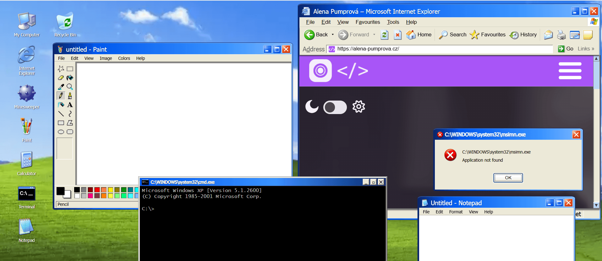

> A browser-based recreation of the Windows XP desktop experience, built with React and TypeScript.  
> 🌐 **[Live Demo](https://alena0490.github.io/Windows-XP/)**

---

## ✨ About

This project started as a simple Minesweeper game and gradually grew into a full Windows XP desktop simulation. It features a working taskbar, Start Menu, draggable windows, XP sound effects, and a collection of functional applications — all styled to match the original Luna theme as closely as possible.

---

## 🎮 Minesweeper

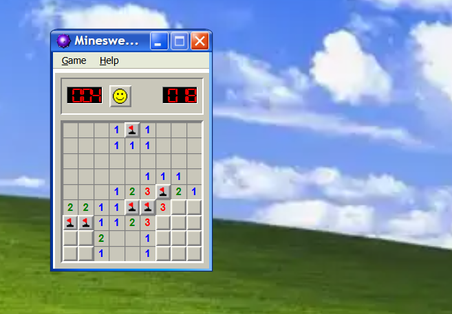

The app that started it all. A fully functional Minesweeper with three difficulty levels and a custom board option.

- **Beginner** (9×9, 10 mines) · **Intermediate** (16×16, 40 mines) · **Expert** (16×30, 99 mines)
- Custom board size (height 9–24, width 9–30, mines 10+)
- Safe first click — mines are never placed on the first clicked cell or its neighbours
- Flood fill reveal for empty cells
- Flag 🚩 and question mark ❓ markers (toggleable)
- Digital mine counter and timer (capped at 999)
- Best times saved to `localStorage` per difficulty
- Sound effects for clicks, win and loss
- Animated face button (😊 / 😲 / 😎 / 💀)
- Death cell highlighted in red

---

## 🎨 Paint

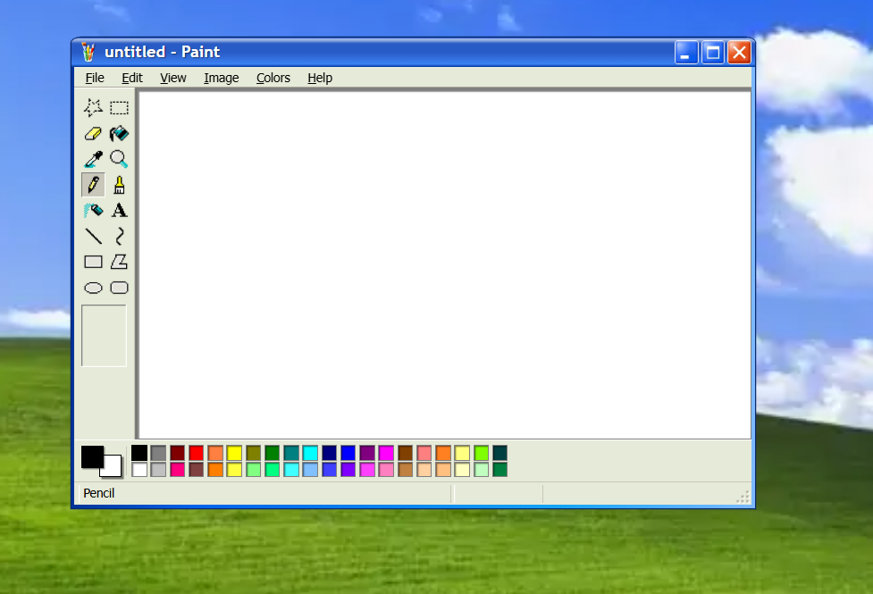

A feature-rich recreation of MS Paint with a full toolbox, colour palette and menu system.

### Tools

- ✏️ Pencil · 🖌️ Brush (round, square, diagonal ×3 sizes) · 💨 Airbrush (3 sizes)
- 🪣 Fill bucket · 💧 Eyedropper · 🔤 Text (with Font toolbar — family, size, bold, italic, underline, vertical)
- ⬜ Rectangle · 🔲 Rounded Rectangle · ⭕ Ellipse · 🔷 Polygon · 〰️ Curve · ➖ Line
- ⬛ Eraser (4 sizes) · 🔍 Zoom (1×/2×/6×/8×) · ✋ Move (pan)
- Rectangular and free-form selection — drag, copy, cut, delete, Ctrl+A

### Canvas

- Default size 700×400 px, resizable via Attributes dialog
- Undo / Redo history · Invert Colours · Flip / Rotate · Stretch / Skew
- Grid overlay (Ctrl+G) · Thumbnail preview (live, 150×100 px)
- Save As `.png` · Open image file · View Bitmap (fullscreen)
- Middle-mouse pan · Pinch-to-zoom on touch (0.25×–4×)
- Custom cursors per tool

**Colour palette** — 40 classic XP colours, foreground/background swap

---

## 🌐 Internet Explorer

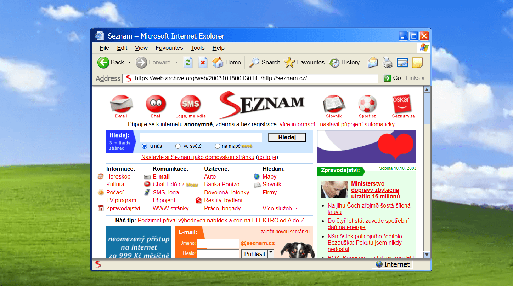

A working browser window powered by `<iframe>`, styled as Internet Explorer 6.

- Full menu bar (File, Edit, View, Favourites, Tools, Help) with mnemonics and nested submenus
- Standard toolbar (Back, Forward, Refresh, Stop, Home, Search, Favourites, History, Print…)
- Address bar with favicon, live page title in the title bar
- Navigation history (back / forward)
- Status bar and toggleable toolbars
- Blocked domains list (social media, modern news sites, adult content, AI tools…)
- Custom error page when a blocked or unavailable site is requested

### 🕰️ Favourites — Retro Websites

All bookmarks point to period-accurate archived versions of real websites, sourced from the [Wayback Machine](https://web.archive.org) (primarily 2001–2005).

| Folder | Highlights |
| --- | --- |
| 🔍 Search & Mail | Google, Seznam.cz, Seznam E-mail, ICQ, xChat, Centrum.cz |
| 👥 Social | Lidé.cz, Spolužáci, Libimseti.cz, LinkedIn, Zpovědnice |
| 🎮 Games | Superhry.cz, Českéhry.cz, Happy Tree Friends, Miniclip |
| 🎬 Entertainment | Alena Pumprová, Nova.cz, Kinobox.cz, Lamer.cz iDnes.cz, Očko TV |
| 💻 Tech | Microsoft.com , Mobilmania.cz, MSN |

---

## 🔢 Calculator

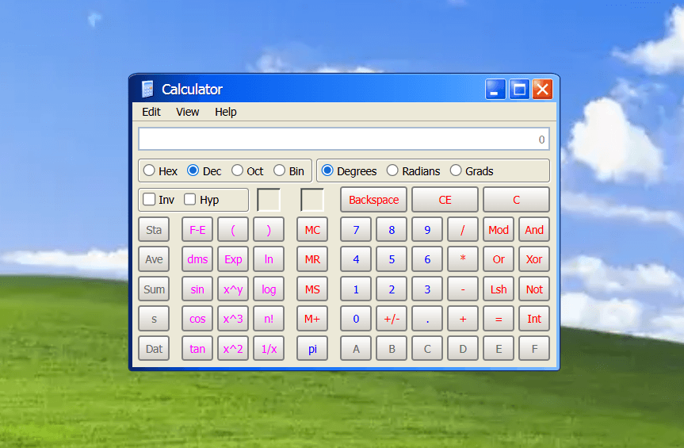

A two-mode calculator with keyboard support.

### Standard mode

- Basic arithmetic · Memory (MC / MR / MS / M+) · `sqrt`, `%`, `1/x`
- Digit grouping (cs-CZ locale)

### Scientific mode

- Trigonometry: `sin`, `cos`, `tan` with **Inv** (arcus) and **Hyp** modifiers
- Angle modes: Degrees · Radians · Grads
- `log`, `ln`, `x²`, `x³`, `xʸ`, `n!`, `π`, `1/x`, `Int`, `F-E`, `Exp`, `dms`
- Bitwise: `And`, `Or`, `Xor`, `Not`, `Lsh`, `Mod`
- Number bases: **Hex** · **Dec** · **Oct** · **Bin** — unavailable digits disabled automatically

---

## 💻 Terminal

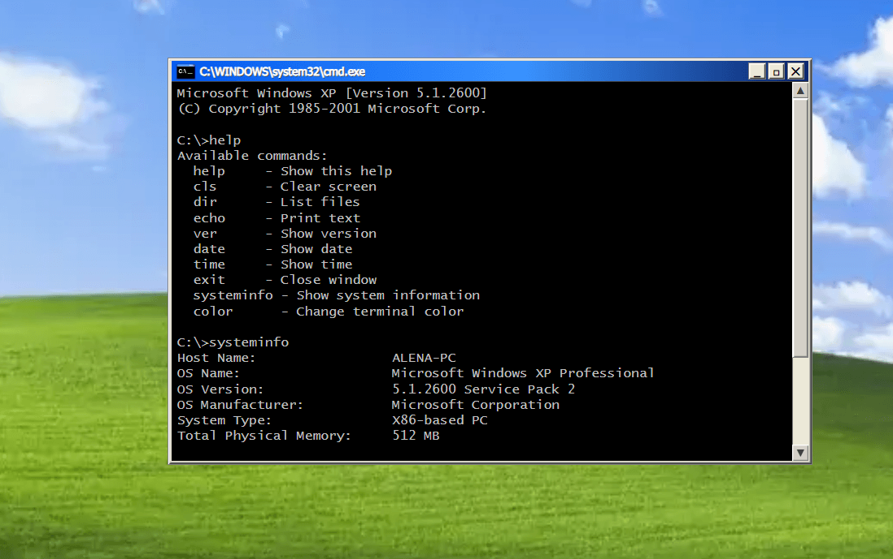

A Command Prompt window with an authentic XP look and a set of working commands.

- Font: Lucida Console · Width: 80ch · 25 visible lines
- `color XY` supports 16 colours (e.g. `color 0A` = black background, green text)
- `systeminfo` reveals developer info 🙂

```C:\>help

Available commands:
  help       - Show this help
  cls        - Clear screen
  dir        - List installed apps with file sizes
  echo       - Print text
  ver        - Show Windows version
  date       - Show current date
  time       - Show current time
  systeminfo - Show system & developer info
  color XY   - Change background and text colour (16 colours)
  exit       - Close the window
```

---

## 📝 Notepad

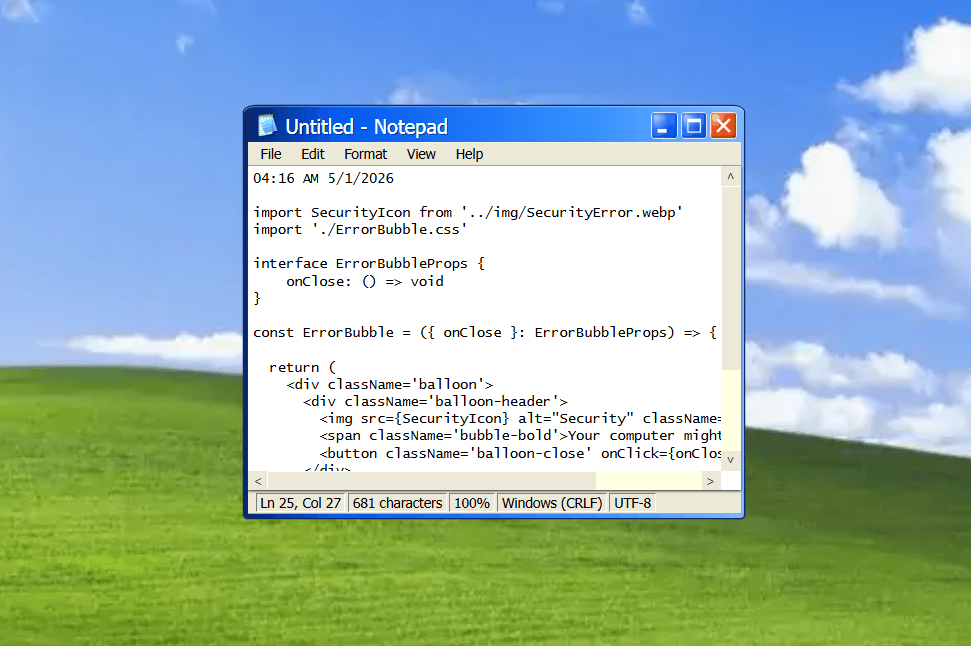

A lightweight text editor with more features than you might expect.

- Open and save `.txt` files
- Undo / Redo (custom history stack)
- **Find** — with Match Case, Wrap Around and Up/Down direction
- **Replace** and **Replace All**
- Word Wrap toggle
- Insert Date/Time
- Status bar: line, column, character count, encoding (UTF-8), line endings (CRLF)
- Classic Windows XP encoding bug — typing "Bush hid the facts" or "what are you doing" and saving will garble the text on reopen

---

## 📁 File Manager

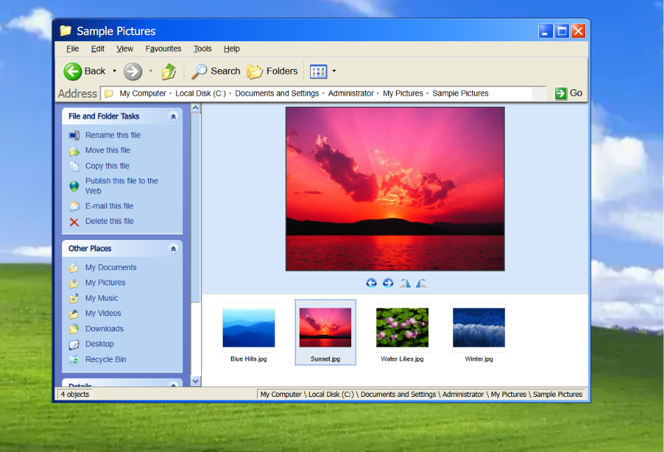

A recreation of Windows Explorer with full folder navigation and multiple view modes.

### Features

- **5 view modes** — Thumbnails, Tiles, Icons, List, Details
- Full folder tree navigation with Back / Forward / Up buttons and keyboard shortcuts (Backspace, Alt+←, Alt+→)
- Breadcrumb address bar with clickable path segments
- Sort by Name, Size, Type or Date Modified
- **Picture Viewer** — inline image viewer with filmstrip, Prev/Next navigation (keyboard arrows supported) and rotation
- **Sidebar** — context-aware Tasks, Other Places and Details panels, collapsible groups
- **History** sidebar and Tip of the Day panel
- Thumbnail previews for image files, photo folder preview (2×2 grid)
- Status bar with object count and current path
- Open `.txt` files directly in Notepad
- Original Windows XP sample pictures and wallpapers

---

## 🎵 Windows Media Player

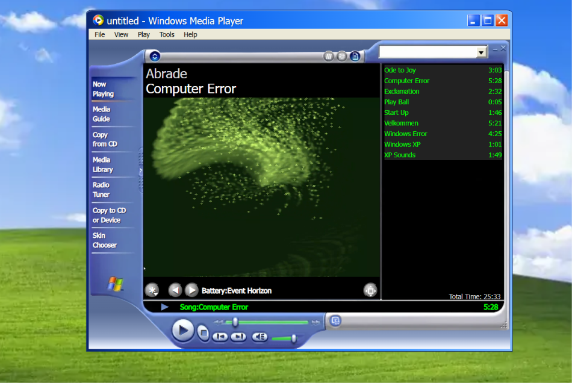

A recreation of Windows Media Player 8, with full playlist support, visualizations and album art.

### Playback

- Play, Pause, Stop, Previous, Next
- Shuffle and Repeat modes
- Play Speed — Slow (0.5×), Normal (1×), Fast (2×)
- Volume control with XP-style slider and Mute toggle
- Progress bar with seek support
- Auto-advance to next track when a song ends
- Keyboard shortcuts — `Ctrl+P` Play/Pause · `Ctrl+S` Stop · `Ctrl+B` Previous · `Ctrl+F` Next · `Ctrl+H` Shuffle · `Ctrl+T` Repeat · `F8` Mute · `F9` Volume Down · `F10` Volume Up

### Playlist & Library

- Opens songs directly from File Manager (double-click `.mp3`)
- Entire folder loaded as playlist automatically
- Playlist shows track names and durations
- Total playlist time displayed
- Click any track in the playlist to jump to it
- Open button launches File Manager to browse music

### Visualizations

- **Album Art** — displays cover image when available
- **Ambience** — Water · Falloff · Swirl · Random
- **Bars and Waves** — Bars · Ocean Mist · Fire Storm · Scope
- **Battery** — Randomization · Lotus · Event Horizon · Smoke or Water?
- **Particle** — Particle · Rotating Particle
- **Plenoptics** — Random · Smokey Circles · Smokey Lines · Vox
- **Spikes** — Spike
- **Musical Colors** — Colors in Motion
- Switch visualizations via menu or ✱ dropdown · cycle presets with ◀ ▶ buttons

### UI

- Full menu bar — File, View, Play, Tools, Help
- Full Mode / Skin Mode toggle (`Ctrl+1` / `Ctrl+2`)
- Fullscreen mode
- Left sidebar with navigation categories
- Taskbar integration — minimize and restore

---

## 🪟 Desktop & Shell

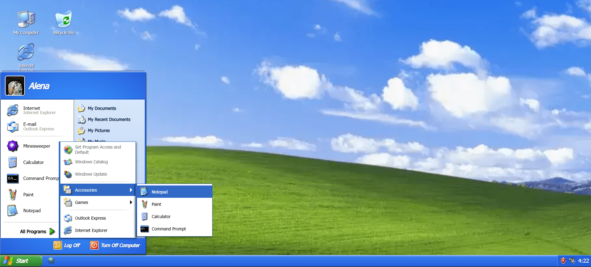

- **Taskbar** — shows open applications, active/minimised state, live clock, volume icon and a security notification balloon (appears after 5 seconds)
- **Start Menu** — full two-panel layout with user avatar (Alena 🐱), pinned apps, All Programs submenu (Accessories, Games), right panel with system shortcuts, Log Off and Turn Off Computer buttons
- **Desktop icons** — My Computer, Internet Explorer, Minesweeper, Paint, Calculator, Terminal, Notepad, Recycle Bin
- **Error dialogs** — `appNotFound`, `accessDenied`, `hardDriveFailure`, `renameExtension` — each with the correct icon and button set
- **Login Screen** — Windows XP-style login displayed on startup, pre-filled credentials, also gates browser autoplay restrictions
- **XP Loading Screen** — animated progress bar, Windows XP logo, startup sound, shown on startup and after Restart

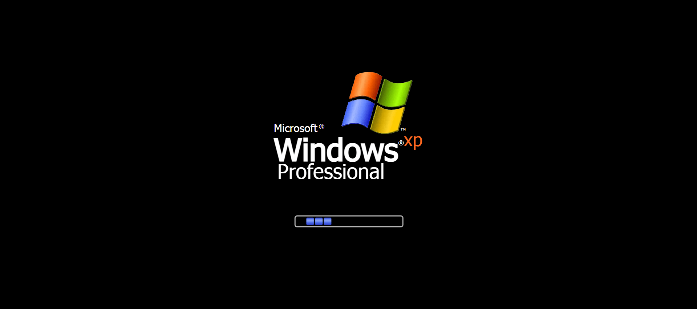

- **Shutdown Screen** — Turn Off Computer and Log Off dialogs opened from the Start Menu, with Stand By / Restart / Switch User options and animated grayscale overlay

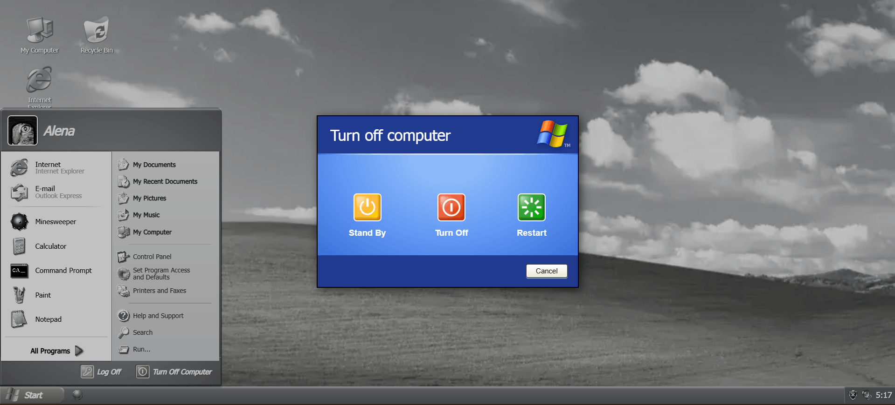

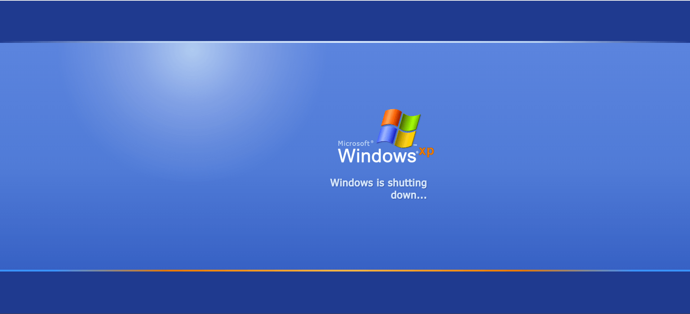

---

## 🛠️ Tech Stack

- **React 18** + **TypeScript**
- **Vite** (with manual chunk splitting per app)
- Custom hooks — `useDraggable`, `useDraggableDialog`, `useWindowState`, `useSound`, `usePaintHistory`, `usePaintSelection`, `usePaintShapeDrawing`, `usePaintPanning`, `usePaintFileActions`, `useCalculatorLogic`
- Pure CSS — no UI library, custom XP Luna variables, bevel utilities, XP scrollbars

---

## 🔊 Assets & Credits

- 🔉 **XP Sounds** — [joshlalonde on DeviantArt](https://www.deviantart.com/joshlalonde/art/Windows-XP-Sounds-158309567)
- 🖼️ **XP Icons (high-res)** — [WinClassic.net](https://winclassic.net/thread/1442/windows-high-resolution-icon-pack)
- 🖼️ **XP Icons (alternative)** — [ducbao414/win32.run on GitHub](https://github.com/ducbao414/win32.run/tree/main/static/images/xp/icons)
- 🕰️ **Archived websites** — [Wayback Machine](https://web.archive.org)
- 🎨 **WMP Skins and Icons** — [WMP Goodies](https://sites.google.com/view/wmpgoodies/skins)
- 🎵 **XP Soundtrack** — [Internet Archive](https://archive.org/details/windows-xp-complete-soundtrack)

---

## 🚧 Coming Soon

- 🃏 Solitaire

---

*© 2026 [Alena Pumprová](https://alena-pumprova.cz/)*
